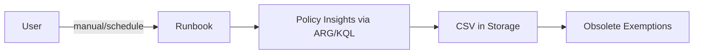
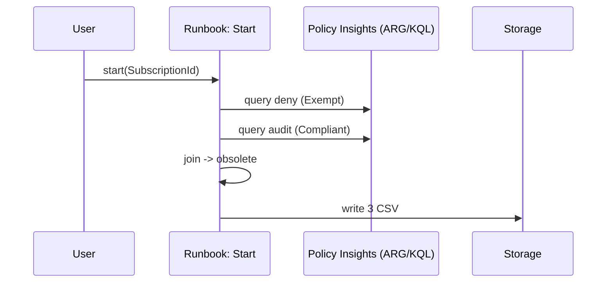
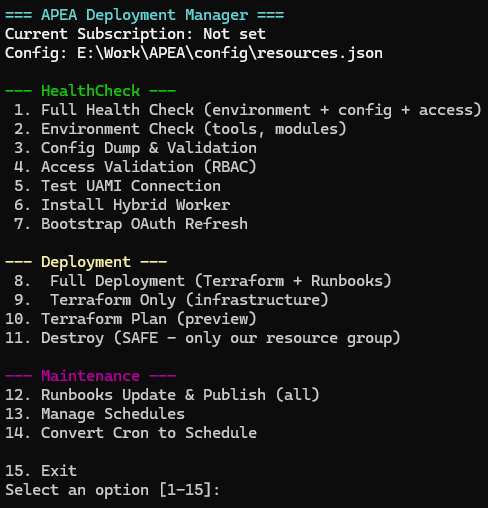

# Azure Policy Exemption Analyzer (APEA)

**TL;DR:** Export policy state via ARG (KQL) and find exemptions you can retire.

- Source: **Azure Resource Graph / Policy Insights**
- Orchestration: **Azure Automation Runbooks** (Managed Identity)
- Files: `deny_<subscriptionId>.csv`, `audit_<subscriptionId>.csv`, `policyExemptionObsolete.csv`

---

## Table of Contents
- [Overview](#overview)
- [Architecture](#architecture)
- [Outputs](#outputs)
- [Requirements](#requirements)
- [Run — Main (UI)](#run--main-ui)
- [Run — Manual (CLI)](#run--manual-cli)
- [Runbooks](#runbooks)
- [Configuration](#configuration)
- [KQL](#kql)
- [Scheduling & Retention](#scheduling--retention)
- [Troubleshooting](#troubleshooting)
- [Security](#security)
- [Performance](#performance)
- [Observability](#observability)
- [License](#license)

---

## Overview
No client-side loops. Just KQL in ARG. Collect `deny` (Exempt), collect `audit` (Compliant), join, get a list of obsolete exemptions.

---

## Architecture
Details in [`docs/architecture.md`](docs/architecture.md).





---

## Outputs
`azreports/<prefix>/<subscriptionId>/<yyyyMMdd-HHmmss>/`  
- `deny_<subscriptionId>.csv`
- `audit_<subscriptionId>.csv`
- `policyExemptionObsolete.csv`

_No `policyExemptionSummary.csv`._

---

## Requirements
**RBAC (subscription / storage):**
- `Reader`
- `Resource Policy Insights Data Reader`
- `Storage Blob Data Contributor` (on the Storage Account)

**Tools:** PowerShell 7.x, Azure CLI 2.49+ with `resource-graph` extension

Login and set context:
```bash
az extension add --name resource-graph --only-show-errors
az login
```
### Login


---

## Run — Main (UI)


`scripts/main.ps1` is a simple menu with 14 actions.

```powershell
pwsh .\scripts\main.ps1 -SubscriptionId <SUBSCRIPTION_ID> 
```
**Or run without any keys:**


**HealthCheck**

- Full Health Check
- Environment Check
- Config Dump & Validation
- Access Validation (RBAC)
- Test UAMI Connection
- Install Hybrid Worker
- Bootstrap OAuth Refresh


**Deployment**

- Full Deployment (infra + runbooks)
- Terraform Only
- Terraform Plan
- Destroy (SAFE, project RG only, asks for `yes`)


**Maintenance**

- Runbooks Update & Publish (all)
- Manage Schedules (for `Start`)
- Convert Cron to Schedule


**Destroy**

If you need to clear a tenant of APEA, run destroy , it will safely destroy everything that belongs to the resource group described in the config.


---

## Run — Manual (CLI)

### Local
```bash
mkdir -p out
az graph query -q @queries/deny.kql  --subscriptions "$SUBSCRIPTION_ID" --first 5000 --output csv > "out/deny_${SUBSCRIPTION_ID}.csv"
az graph query -q @queries/audit.kql --subscriptions "$SUBSCRIPTION_ID" --first 5000 --output csv > "out/audit_${SUBSCRIPTION_ID}.csv"
pwsh -Command "
  \$s='$env:SUBSCRIPTION_ID';
  \$a=Import-Csv \"out/audit_\$s.csv\"; \$d=Import-Csv \"out/deny_\$s.csv\";
  \$i=@{}; foreach(\$r in \$a){ \$k=\$r.policyDefinitionId+'|'+\$r.resourceName; if(-not \$i.ContainsKey(\$k)){ \$i[\$k]=\$r } }
  \$o=foreach(\$ex in \$d){ \$k=\$ex.policyDefinitionId+'|'+\$ex.resourceName; if(\$i.ContainsKey(\$k)){ [pscustomobject]@{
    ResourceName=\$ex.resourceName; PolicyDefinitionId=\$ex.policyDefinitionId; PolicyDefinitionName=\$ex.policyDefinitionName;
    PolicyAssignmentName=\$ex.policyAssignmentName; ExemptionStatus=\$ex.complianceState; CompliantStatus=\$i[\$k].complianceState;
    Reason='POLICY_NOW_COMPLIANT'; AnalysisTimestamp=(Get-Date).ToString('s'); SubscriptionId=\$s } } }
  \$o | Export-Csv 'out/policyExemptionObsolete.csv' -NoTypeInformation -Encoding UTF8
"
```

(Optional) upload:
```bash
az storage blob upload \
  --account-name "<storage>" --container-name "azreports" \
  --name "policy-compliance/$SUBSCRIPTION_ID/$(date +%Y%m%d-%H%M%S)/policyExemptionObsolete.csv" \
  --file out/policyExemptionObsolete.csv --auth-mode login
```

### Azure Automation
Portal: run `Start`, set `SubscriptionId`.  
CLI:
```bash
az automation runbook start \
  --automation-account-name <automation-account> \
  --resource-group <automation-rg> \
  --name Start \
  --parameters SubscriptionId="$SUBSCRIPTION_ID"
```

List blobs:
```bash
az storage blob list --account-name <storage> --container-name azreports \
  --prefix policy-compliance/$SUBSCRIPTION_ID/ \
  --query "[?ends_with(name, '.csv')].[name, properties.contentLength]" -o table
```


---

## Runbooks
See [`docs/Runbook_Contract.md`](docs/Runbook_Contract.md).  
- `Start.ps1` → orchestrates: validate → `KqlCollect.ps1` → `PolicyCompliance.ps1`  
- `KqlCollect.ps1` → runs two KQL queries, writes `deny_*.csv`, `audit_*.csv`  
- `PolicyCompliance.ps1` → joins and writes `policyExemptionObsolete.csv`

---

## Configuration
| Setting | Where | Purpose |
|---|---|---|
| `APEA_SUBSCRIPTION_ID` | local / `Start` param | query scope |
| `ARTIFACT_STORAGE_ACCOUNT_NAME` | Automation Variable | CSV destination |
| `ARTIFACT_STORAGE_ACCOUNT_RG` | Automation Variable | storage RG |
| `STORAGE_CONTAINER_NAME` | Automation Variable | e.g., `azreports` |
| `STORAGE_FOLDER_PREFIX` | Automation Variable | e.g., `policy-compliance` |
| `USER_ASSIGNED_MI_*` (opt) | Automation Variable | bind explicit UAMI |

Secrets → encrypted Automation variables / Key Vault.

---

## KQL
Files: [`queries/deny.kql`](queries/deny.kql), [`queries/audit.kql`](queries/audit.kql)

```kusto
// deny (Exempt)
PolicyResources
| where type =~ 'microsoft.policyinsights/policystates'
| where tolower(tostring(properties.policyDefinitionAction)) == 'deny'
| where tolower(tostring(properties.complianceState)) == 'exempt'
| extend resourceId = tostring(properties.resourceId)
| extend resourceName = tostring(split(resourceId, '/')[-1])
| extend policyDefinitionId = tostring(properties.policyDefinitionId)
| extend policyDefinitionName = tostring(split(policyDefinitionId, '/')[-1])
| extend policyAssignmentName = tostring(properties.policyAssignmentName)
| project name, resourceName, location, subscriptionId, type,
         policyDefinitionName, policyDefinitionId, policyAssignmentName, complianceState
```

```kusto
// audit (Compliant)
PolicyResources
| where type =~ 'microsoft.policyinsights/policystates'
| where tolower(tostring(properties.policyDefinitionAction)) == 'audit'
| where tolower(tostring(properties.complianceState)) == 'compliant'
| extend resourceId = tostring(properties.resourceId)
| extend resourceName = tostring(split(resourceId, '/')[-1])
| extend policyDefinitionId = tostring(properties.policyDefinitionId)
| extend policyDefinitionName = tostring(split(policyDefinitionId, '/')[-1])
| extend policyAssignmentName = tostring(properties.policyAssignmentName)
| project name, resourceName, location, subscriptionId, type,
         policyDefinitionName, policyDefinitionId, policyAssignmentName, complianceState
```

Large tenants: split by `policyAssignmentId` or use continuation (REST).

---

## Scheduling & Retention
- Timestamped folders `<yyyyMMdd-HHmmss>`
- One schedule per subscription
- Storage lifecycle rules for retention

---

## Troubleshooting
- `az login` ok, no subscriptions → use `--tenant`
- 403 → assign `Reader` + `Resource Policy Insights Data Reader`
- Upload fails → `Storage Blob Data Contributor` on the account
- 429 → reduce scope or retry
- Quoting → use `@queries/*.kql`

More: [`docs/Troubleshooting.md`](docs/Troubleshooting.md)

---

## Security
Least privilege. Managed Identity by default. See [`docs/auth_options.md`](docs/auth_options.md).

---

## Performance
Filter early, project less, split large runs.

---

## Observability
Automation job streams (`Start`, `KqlCollect`, `PolicyCompliance`). Storage metrics. Day‑2: [`docs/Operations.md`](docs/Operations.md).

---

## License
MIT
